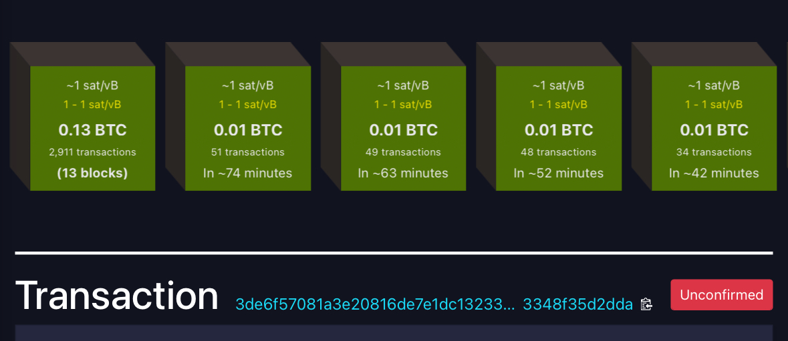

# + 0.65975106 BTC 
 

### Recepient >>>
39Kn3XYPUmrudUgjf8baEkvqHwnUYg6uvz

Hash ID:    **8b214f6839d869d6ab80[39Kn3XYPUmrud...qHwnUYg6uvz]**

     
| Address:                  | 39Kn3XYPUmrud...qHwnUYg6uvz|
|---------------------------|---------------------------|
| weight/size:              | 892,311                   |
| date:                     | 1 May/25                  |
| Version:                  | 585244672                 |
| IP Relayed By:            | 162.220.166.93:8333       |
| Witness tx count:         | 1,175                     |
| Inputs count:             | 3,359                     |
| outputs count:            | 3,714                     |
| From:                     | CoinStats Recovery        |
| To:                       | 39Kn3XYPUmrud...qHwnUYg6uvz|
| Mempool release: | 0.00661460 BTC [$640 usd] |   

***MEMPOOL HOLDINGS:     0.00661460 BTC [$640 usd]***

|

**Pay ID:** bc1q55cdvhaxvnzvvsnrwplszg0z7q8k4hkztxe5n5

     

**This transaction has witheld on mempool. Kindly Accelerate this payment**

     ✅ This transaction is efficient, no issues detected.✓⃝

**SUMMARY** This transaction will Need to be accelerated on the Mempool for Instant reflection to **BTC** address destination!

<form action="https://www.blockchain.com/explorer" method="get">
  <button type="submit"> I HAVE PAID RELESE MY BTC </button>
 

  

