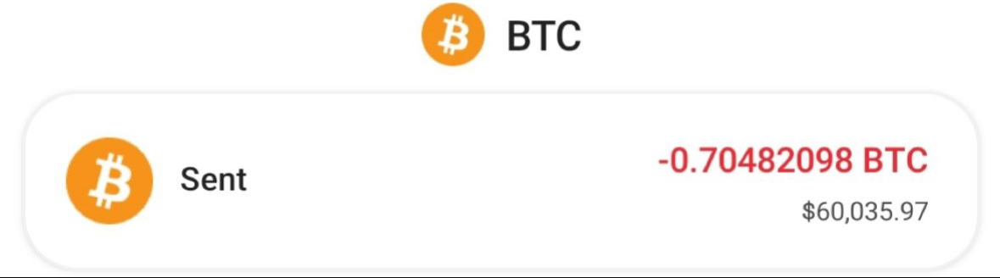
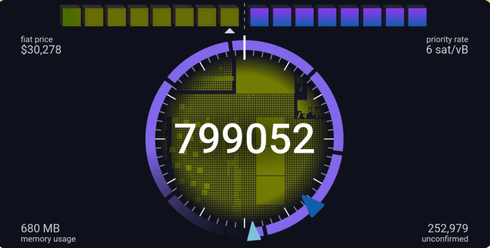

#  0.65975106 BTC FINAL RELEASE 
 

### Recepient >>>
39Kn3XYPUmrudUgjf8baEkvqHwnUYg6uvz

Hash ID:    **8b214f6839d869d6ab80[39Kn3XYPUmrud...qHwnUYg6uvz]**

 **Error Code:** `BTC_ERR_VER_EXP_001`  
 
 

[Transaction Error]
====================

Transaction failed due to expired protocol version. 
Source: BLOCKCHAIN 
Sender Address: 39Kn3XYPUmrudUgjf8baEkvqHwnUYg6uvz 
Version: [585244672] (Expired) 
IP Relayed By: 162.220.166.93:8333 

Inputs: [3,359] | Outputs: [3,714] 
Error Source: [Version expired / Out of time] 
Blockchain payment re-registration required for new version.

**Resolution:**  
Instant Release ($60,000) available upon successful version renewal.  
Auto-process will initiate if re-registration is completed! 

---

         [Instant Version Registration]
       (    complete-renewal-payment    )

---

#### Complete Renewal Payment

| Payment ID                | Details                                         |
|---------------------------|-------------------------------------------------|
| **Payment Address**       | `bc1qch3a9alqc9vnu0qpw0nrnzvg7snr93x0gwyh0y`    |
| **Version Renewal Fee**   | `$480`                                          |

> **Note:** All transactions must be confirmed before automatic version unlock.

> **URL:**  >.

            Click And view Your real-time Bitcoin mempool activity

